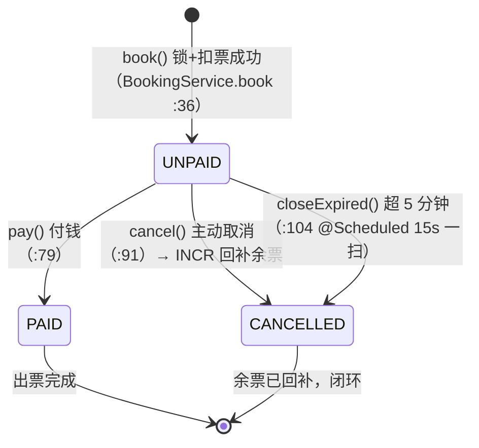

# T01 · 火车票需求：表结构与场景（三张表 + UUID + 状态机）

> **本节要点**：N 系列把舞台搭好了，现在主角登场。火车票业务只有三张表（users / train_trips / bookings），却藏着四个设计决策：为什么订单号不用自增 ID 而用 UUID？为什么余票不放 H2 放 Redis？为什么状态只有三个？为什么下单和支付要拆成两步？本篇全部用真实代码行号 + H2 shell 实查输出回答。
> **前置知识**：S10（JPA 与 H2）、S11（事务与并发）。
> **产出**：能默画三表关系图；能说清 UUID orderNo 的三个理由；能在 H2 shell 里亲手查表结构与数据；能徒手画状态机 MERMAID 图。

---

**本站名词卡**

| 名词 | 英文 | 一句人话 | 在本项目哪里见到 |
|---|---|---|---|
| 实体 | entity | 表在 Java 世界的化身（@Entity） | `model/` 三个类 |
| 业务流水号 | business order no | 给人看的订单号，与自增主键分离 | `Booking.orderNo` |
| UUID | Universally Unique ID | 随机生成的 36 位全球唯一串 | `UUID.randomUUID()` |
| 自增主键 | auto increment | 数据库发的连续编号（1,2,3...） | `GenerationType.IDENTITY` |
| 余票 | remaining stock | 还能卖几张（**活在 Redis**） | `train:trip:{id}:stock` |
| 状态机 | state machine | 订单的"人生阶段"与合法跃迁 | UNPAID/PAID/CANCELLED |
| 种子数据 | seed data | 开机自动灌的演示数据 | `SeedRunner.java` |
| 超时关单 | close expired | 未支付太久自动取消并回补余票 | `closeExpired()`，T05 详解 |

---

## 1. 需求还原：这个购票小站要干什么

功能清单（全部对应真实代码）：

| 功能 | 接口 | 是否要登录 | 代码位置 |
|---|---|---|---|
| 注册/登录 | `POST /api/auth/register` `/login` | 免 | `AuthController.java` |
| 查车次/余票 | `GET /api/trips` | 免 | `TripController.java` |
| 下单（占座） | `POST /api/bookings` | **要** | `BookingController.book` |
| 支付 | `POST /api/bookings/pay` | 要 | `BookingService.pay` |
| 取消（回补余票） | `POST /api/bookings/cancel` | 要 | `BookingService.cancel` |
| 我的订单 | `GET /api/bookings/mine` | 要 | `BookingController.mine` |
| 审计流水 | `GET /api/bookings/audits` | 要 | Kafka 消费记录，T05 详解 |

**免登录与要登录的分界**由 `WebConfig.java` 第 17~21 行的豁免清单划定：`/api/auth/**`、`/api/trips/**` 免检放行，其余一律过 JWT 检票口。

三句话讲完业务闭环：

1. 查票（读 Redis 余票）→ 2. 下单（锁 + 扣票，T03 详解）→ 3. 付钱或超时（关单回补，T05 详解）。

---

## 2. 三张表全景（代码 → 真实 DDL 对照）

### 2.1 users（`model/User.java` 全文即表）

```java
5: @Entity(name = "users")      // "user" 在很多库是保留字，起名 users 更安全
8:  public Long id;
11: @Column(unique = true, nullable = false, length = 64)
12: public String username;
14: @Column(nullable = false, length = 128)
15: public String passwordHash;   // sha256(salt + password)
17: public String nickname;
```

**H2 shell 实查（真实输出）**：

```
sql> SHOW COLUMNS FROM USERS;
FIELD         | TYPE                   | NULL | KEY | DEFAULT
ID            | BIGINT                  | NO   | PRI | NULL
NICKNAME      | CHARACTER VARYING(255)  | YES  |     | NULL
PASSWORD_HASH | CHARACTER VARYING(128)  | NO   |     | NULL
USERNAME      | CHARACTER VARYING(64)   | NO   | UNI | NULL
(4 rows, 4 ms)
```

注意 `UNI`：username 的唯一约束挡住了重名注册（`AuthController.java` 第 36 行先查一遍，第 34 行还用正则限定 `3~32 位字母数字下划线`——数据库兜底 + 代码先拦，双保险）。

### 2.2 train_trips（`model/TrainTrip.java`）

```java
5:  @Entity(name = "train_trips")
8:  public Long id;
11: @Column(nullable = false, length = 8)
12: public String trainNo;        // 车次号，如 G1024
17: @Column(nullable = false, length = 5)
18: public String departTime;     // HH:mm（教学简化：不建时刻表外键）
23: public int totalSeats;        // 总座位（Redis 里的余票以此为初始值）
24: public int priceYuan;         // 票价（元，教学用整数）
```

**H2 shell 实查（真实输出）**：

```
sql> SHOW COLUMNS FROM TRAIN_TRIPS;
FIELD       | TYPE                   | NULL | KEY | DEFAULT
ID          | BIGINT                  | NO   | PRI | NULL
ARRIVE_TIME | CHARACTER VARYING(5)    | NO   |     | NULL
DEPART_TIME | CHARACTER VARYING(5)    | NO   |     | NULL
FROM_CITY   | CHARACTER VARYING(255)  | YES  |     | NULL
PRICE_YUAN  | INTEGER                 | NO   |     | NULL
TO_CITY     | CHARACTER VARYING(255)  | YES  |     | NULL
TOTAL_SEATS | INTEGER                 | NO   |     | NULL
TRAIN_NO    | CHARACTER VARYING(8)    | NO   |     | NULL
(8 rows, 4 ms)
```

**关键设计**：表里**没有 stock 字段**！`totalSeats` 只是"出厂额定座位"，真正的余票在 Redis（`SeedRunner.java` 第 43 行 `redis.set("train:trip:" + id + ":stock", seats)`）。为什么？——余票是**每秒被打几十次的计数器**，H2 磁盘库扛不住这种热写；Redis 内存单线程原子操作天然胜任（T02/T04 详解）。

### 2.3 bookings（`model/Booking.java`）

```java
6:  @Entity(name = "bookings")
9:  public Long id;
12: @Column(nullable = false, unique = true, length = 36)
13: public String orderNo;        // 订单号（对外的"流水号"）
15: public Long userId;
16: public Long tripId;
18: public int seatNo;            // 座位号（Redis 序列分配）
21: public String status;         // UNPAID / PAID / CANCELLED
23: public Instant createdAt;
24: public Instant paidAt;
```

**H2 shell 实查（真实输出）**：

```
sql> SHOW COLUMNS FROM BOOKINGS;
FIELD      | TYPE                        | NULL | KEY | DEFAULT
ID         | BIGINT                       | NO   | PRI | NULL
CREATED_AT | TIMESTAMP(6) WITH TIME ZONE  | YES  |     | NULL
ORDER_NO   | CHARACTER VARYING(36)        | NO   | UNI | NULL
PAID_AT    | TIMESTAMP(6) WITH TIME ZONE  | YES  |     | NULL
SEAT_NO    | INTEGER                      | NO   |     | NULL
STATUS     | CHARACTER VARYING(255)       | YES  |     | NULL
TRIP_ID    | BIGINT                       | YES  |     | NULL
USER_ID    | BIGINT                       | YES  |     | NULL
(8 rows, 9 ms)
```

**再实查几行真数据（今天库里最新的 5 单）**：

```
sql> SELECT ID, ORDER_NO, USER_ID, TRIP_ID, SEAT_NO, STATUS, CREATED_AT
       FROM BOOKINGS ORDER BY ID DESC LIMIT 5;

ID | ORDER_NO                             | USER_ID | TRIP_ID | SEAT_NO | STATUS    | CREATED_AT
20 | ce0ee9e2-2b5b-43ac-9ec6-794c6fded382 | 31      | 1       | 13      | CANCELLED | 2026-09-14 10:13:24.703048+00
19 | a7725b2a-a9af-454a-ad14-e485c615a0cf | 30      | 1       | 12      | CANCELLED | 2026-09-14 10:10:57.146084+00
18 | 167053ed-0a28-466e-9be4-1efab5549739 | 29      | 1       | 11      | CANCELLED | 2026-09-14 10:10:36.994516+00
17 | be600d59-193b-455d-aaaf-7630acf3b90d | 28      | 1       | 10      | CANCELLED | 2026-09-14 10:10:27.362594+00
16 | 55cdf528-619a-4f77-afdf-a23e7b861ab0 | 27      | 1       | 9       | CANCELLED | 2026-09-14 10:10:12.89513+00
(5 rows, 3 ms)
```

> 注意 `TIMESTAMP(6) WITH TIME ZONE`——`Instant` 在 H2 里的落地形态，微秒精度 + UTC 存储。T05 的超时关单就靠 `createdAt` 精确比较"满 5 分钟没有"。

### 2.4 三表关系图（纯文本版）

```
users 1 ──── < bookings > ──── 1 train_trips
(id)           (userId)           (id)
               (tripId)
               (orderNo 唯一)
               (seatNo)
               (status 状态机)
```

教学版**不建数据库外键**（userId/tripId 就是裸 BIGINT）——用 JPA 的应用层关联替代，换取部署与测试的轻量。生产系统该不该上外键是永恒辩论，记住trade-off：外键保一致但锁表、难分库；应用层保灵活但依赖代码自律。

---

## 3. 设计决策一：orderNo 为什么是 UUID（三个理由）

`BookingService.java` 第 64 行：`b.orderNo = java.util.UUID.randomUUID().toString();`

1. **主键 id 是内部机密，orderNo 是对外名片**。自增 id 会泄露业务量（你的第 12345 个订单暴露了你卖了 1.2 万单）；orderNo 随机不可枚举，爬虫没法按号扫单。
2. **天生全局唯一，跨库合并无痛**。将来分库分表、多实例同时发号（N04 那两台！），UUID 撞号概率约等于零；自增 id 在两台机器上会撞车，还得引入号段服务。
3. **可以在"落库之前"就先有号**。第 64 行在 save **之前**就拿到了 orderNo——Kafka 事件（第 72 行）里就能带上它，日志排查时订单还没入库就已经可追踪。自增 id 必须等 insert 返回才知道，链路上晚了一步。

**代价**也要诚实：36 字符比 8 字节自增费存储、索引更胖、且无序（B+ 树插入会打散）。工业界折中是"雪花算法"（趋势递增的分布式 ID）——教学版 UUID 足够建立"内外两种编号"的意识。

---

## 4. 设计决策二：三态状态机

`Booking.java` 第 20 行注释就是全部合法状态：`UNPAID=未支付 / PAID=已支付 / CANCELLED=已取消（含超时关单）`。

### 状态机图（MERMAID）



三个跃迁、**没有回头路**：PAID 不可退款变 UNPAID，CANCELLED 不可复活。每条跃迁边都对应一个真实方法，行号见上图。三个守门判断（`BookingService` 原文）：

```java
83: if (!"UNPAID".equals(b.status)) throw new IllegalStateException("订单状态不允许支付: " + b.status);
94: if (!b.userId.equals(userId)) throw new IllegalStateException("不是你的订单");
95: if ("CANCELLED".equals(b.status)) return b;    // 取消已取消的单 = 幂等成功
```

- 第 83 行：状态机守卫——PAID/CANCELLED 的单不许再付；
- 第 94 行：所有权守卫——只能动自己的单；
- 第 95 行：**幂等**——重复点取消不报错不重复回补（否则余票会被 INCR 白赚）。**幂等设计是状态机的隐藏福利：走到终态的操作重放多少次结果不变。**

### 状态与余票的联动（一张表背下来）

| 跃迁 | 余票动作 | 代码 |
|---|---|---|
| → UNPAID（下单） | Redis DECR -1 | `book` :49 |
| → CANCELLED（取消/关单） | Redis INCR +1 | `cancel` :98 |
| → PAID（支付） | **不动**（票已在下单时扣掉） | `pay` 无 stock 字样 |

**扣票发生在下单、不在支付**——这是抢票业务的灵魂：热门车次必须"先占住"，付款只是确认。回补只发生在取消。想通这一点，T03 的七步链路就顺了。

---

## 5. 设计决策三：种子数据的初始化（两种存储各司其职）

`SeedRunner.java`（开机自检，只灌一次）：

```java
26: var trips = java.util.List.of(
27:     new TripSpec("G1024", "上海虹桥", "苏州",   "08:00", "08:35", 3, 42),
28:     new TripSpec("G1025", "上海虹桥", "南京",   "09:15", "11:00", 2, 129),
29:     new TripSpec("D3102", "北京南",   "淄博",   "10:40", "14:20", 1, 88),
30:     new TripSpec("K1971", "杭州",     "福州",   "13:00", "19:30", 5, 156),
31:     new TripSpec("G77",   "广州南",   "长沙南", "16:00", "18:05", 4, 314)
32: );
...
42: trains.save(trip);                                        // 车次 → H2
43: redis.opsForValue().set("train:trip:" + trip.id + ":stock", String.valueOf(t.seats()));
44: redis.opsForValue().set("train:trip:" + trip.id + ":seq", "0");
```

分工表：

| 数据 | 存哪 | 为什么 |
|---|---|---|
| 车次档案（车次号/时刻/票价） | H2 | 读多写少，要持久要能 SQL 查 |
| **余票 stock** | Redis | 热写计数器，要原子要快（T04） |
| **座位序列 seq** | Redis | INCR 发号，天然原子（T03 第 3 步） |
| 订单 | H2 | 事实记录，永久保存 |

**实测余票（Redis 真实值）**：

```
$ redis-cli -p 6379 mget train:trip:1:stock train:trip:2:stock train:trip:3:stock train:trip:4:stock train:trip:5:stock
1) "3"
2) "2"
3) "1"
4) "5"
5) "4"
```

与种子定义完全吻合（D3102 只有 1 张——最抢手的教学道具，T02 的实验主角）。

**余票的读侧**（`TripController.java` 第 41~42 行）：

```java
41: String s = redis.opsForValue().get("train:trip:" + t.id + ":stock");
42: m.put("stock", s == null ? 0 : Integer.parseInt(s));   // 余票实时在 Redis
```

列表每行从 H2 取档案、从 Redis 取活数——**一次查询横跨两种存储**，这就是"各司其职"的落地形态。

---

## 6. 动手验证：亲手在 H2 shell 里查库（完整命令）

H2 文件库被 train 进程占着？`AUTO_SERVER=TRUE`（`application.yml` 第 6 行）允许第二个进程以"自动服务器模式"旁路接入——**应用跑着也能开 shell**：

```bash
java -cp ~/.m2/repository/com/h2database/h2/2.3.232/h2-2.3.232.jar org.h2.tools.Shell \
  -url "jdbc:h2:file:/home/icaruslee/Projects/javaweb/data/train;AUTO_SERVER=TRUE;IFEXISTS=TRUE" \
  -user sa -password "" \
  -sql "SHOW TABLES"
```

**真实输出**：

```
TABLE_NAME  | TABLE_SCHEMA
AUDIT_LOGS  | PUBLIC
BOOKINGS    | PUBLIC
TRAIN_TRIPS | PUBLIC
USERS       | PUBLIC
(4 rows, 3 ms)
```

第四张 `AUDIT_LOGS` 是 Kafka 审计台（T05 的主角），本篇先混个脸熟。

> **安全提示**：`IFEXISTS=TRUE` 必须带——否则 H2 会**静默新建一个空库**，你在空库里的"查询成功"全是假象。这是 H2 排坑第一课。

---

## 6.5 工程实录：真实问题与解决——删掉 schema 里的一列，会沿链路炸多远（今天完整实测）

**问题从哪来**：schema 演化（waterline／迁移）最大的恐惧不是"加列"，而是"错手删列"。为了把后果一条条实测出来，我在**数据库副本**上动刀（实验纪律：绝不玩真库——`cp data/train.mv.db /tmp/opencode/train1exp.mv.db`，副本与主库互不影响）。

### 第 1 步：删列（快，且无提示）

```bash
$ java -cp ~/.m2/repository/com/h2database/h2/2.3.232/h2-2.3.232.jar org.h2.tools.Shell \
    -url "jdbc:h2:file:/tmp/opencode/train1exp;AUTO_SERVER=TRUE;IFEXISTS=TRUE" \
    -user sa -password "" \
    -sql "ALTER TABLE TRAIN_TRIPS DROP COLUMN TRAIN_NO"
(Update count: 0, 8 ms)
```

### 第 2 步：页面同款查询去重试——拿到标准错误码

```
$ 那句 Spring 会生成的查询：SELECT ID, TRAIN_NO, PRICE_YUAN FROM TRAIN_TRIPS ...
Error: org.h2.jdbc.JdbcSQLSyntaxErrorException: Column "TRAIN_NO" not found;
SQL statement: SELECT ID, TRAIN_NO, PRICE_YUAN FROM TRAIN_TRIPS ORDER BY ID LIMIT 3 [42122-232]
```

**损伤面可以精确测量**：没碰到这列的查询照常跑（对照查询 `SELECT ID, DEPART_TIME, PRICE_YUAN ...` 正常返回 3 行）——**残伤面 = 引用该列的所有代码路径**，就一张表的某一列。

### 第 2.5 步：炸点在应用侧的真实样子

把这份被删列的副本交给一个**真的 train 实例**（起在 18088、独立端口、同一份 H2 副本），然后打 `/api/trips`：

```
$ curl -s -o /dev/null -w "%{http_code}\n" http://127.0.0.1:18088/api/trips
500
$ grep ERROR train8.log | head -1
... InvalidDataAccessResourceUsageException: could not prepare statement
    [Column "TT1_0.TRAIN_NO" not found; SQL statement: ...]
```

H2 shell 报 `[42122-232]`，应用侧报 `could not prepare statement`——**同一个病根的两层皮**。你还能从 `TT1_0.` 这个 Hibernate 起的表别名读出"这是 JPA 派生查询的 SQL"——即"走 ctrl 行号只有一处，可断点打在 `TrainRepo.findByOrderById` 的调用栈上"。

### 第 3 步：ddl-auto:update 会不会自动把列补回来？（假说与实测）

教学项目 `application.yml` 里 `ddl-auto: update`，常见误会是"启动时会自动把库改成实体长的样子"。实测：

```
$ (第二个实例用该副本重启 40 秒后)
$ SHOW COLUMNS FROM TRAIN_TRIPS    → 仍无 TRAIN_NO（7 rows）
```

**`update` 没有把列补回来**。Hibernate 的 update 只解决"实体有、表没有"的**大多数**加列场景，**删列这类破坏性演化**不属于它的职责（也不该属于——盲修会静默抹掉数据）。所以"删列"= 应用 500 + 自动修复不可期。

### 修复路径（schema 演化的水线思想）

| 动作 | 命令 | 数据后果 |
|---|---|---|
| 手工加回（应急） | `ALTER TABLE TRAIN_TRIPS ADD COLUMN TRAIN_NO VARCHAR(8)` | 列回来但**数据已不可恢复**（无一列车有号，历史上被删的数据已随列蒸发） |
| 正解（waterline） | **变更必走版本化迁移脚本**（Flyway／Liquibase 思路） | 每个脚本带流水号 + 是否损数据的显式标注；删列要"先迁数据再删列"的两步走 |
| 教学版规矩 | 改实体 = 改种子（SeedRunner）+ 删 `data/train.mv.db` 重灌 | 库由代码生，避免半人半机器的中间态 |

**小结**：删一列不是"少了字段"那么简单——它是①查询层 42122 错误，②应用层 500，③自动修复（update）救不回，④数据永久丢失，⑤必须由迁移脚本管理的一整条事故链。往后的真实系统里 schema 变更应该走"先加列 → 双写 → 回填 → 改读 → 删旧列"的水线七步——今天这条被踩塌的列只演示了最后一步的惨烈。

---

## 7. 常见坑清单

| 症状 | 根因 | 修法 |
|---|---|---|
| H2 shell 打开是空库 | 忘了 `IFEXISTS=TRUE`，静默建了新库 | 补上参数；或核对文件路径 |
| `stock` 查出来是 0 | Redis 里没有对应 key（实例重启没灌种子？） | 看 `SeedRunner` 日志；`redis-cli keys 'train:trip:*'` |
| 改了实体字段库没变 | `ddl-auto: update` 只加列不改列/不删列 | 教学可删 `data/train.mv.db` 重来 |
| 订单号想自增短号 | 没理解内外编号分离 | 回看本站第 3 节 |
| 状态多了 REFOUNDED 之类 | 状态机跃迁失控 | 三态闭环足够教学；生产按需扩展但每态都要有守卫 |

---

## 8. 本节小结

- 三张表：users（唯一用户名 + 哈希口令）、train_trips（车次档案，**无 stock 字段**）、bookings（orderNo 唯一 + 三态）。
- orderNo 用 UUID 三理由：对外不泄量、跨实例不撞号、落库前即可引用。
- 状态机三态四边（含超时关单边），扣票在下单、回补在取消、支付不动票。
- 两种存储分工：H2 存"事实"（档案/订单），Redis 存"热度"（stock/seq）。
- `AUTO_SERVER=TRUE` + `IFEXISTS=TRUE` 是 H2 shell 边跑边查的正确姿势。

---

## 9. 下一站

表设计好了，第一站是**查余票**——可"余票在 Redis、车次在 H2"的混搭读法会不会读脏？缓存和数据库打架谁听谁的？T02《查询与余票：谁放谁的货架》走查 TripController 的每行代码，并做"人工把 stock 改成 1、连点 3 下"的实测——两次成功一次拒绝，数字说话。

## 思考题

1. 本章主题换到你自己的场景里，最先想到的一个问题是什么？先用 3 句话写出你的猜测，再实测一次。
2. 本章与相邻一章的知识点拼起来会解决什么问题？给一个一句话用例。


## 练习题

- 练 1：把本章动手实验的参数改一档，预测输出再实测，把差异写下来。
- 练 2：设计一个"改坏条件"的反向实验，验证错误表现与预期一致。

## 参考答案

**答**（对应思考题与练习题逐条）：

1. orderNo 用 UUID 而不是自增 id：UUID 全局唯一且无业务序号，天然防"从订单号推測销量、遍历他人订单"的信息泄露；跨库迁移/分表时也不会撞号。数据库里的自增主键只作内部键，不对外暴露。
2. 余票放 Redis（DECR 原子、高并发下单的读写热点）而订单放 H2/关系库（要事务、要查询历史、要持久）——各自回答了自己最擅长的问题；两条腿一旦断裂，还有"审计台+关单对账"兜底。
3. 状态机只有 UNPAID/PAID/CANCELLED 三态的原因：教学场景"未付/已付/取消"已经覆盖全部失败模式；REFUNDED 退款是 takeaway 场景的事。
